# 7.网络互连

​	TCP在网络层提供的节点间的数据传输服务基础上实现可靠的数据传输。

​	在链路层提供的服务基础上通过**多跳传输**将数据递交到最终目的地。

- 路由器
  - 数据平面：从接口收到一个IP分组后查找转发表，转发到下一跳
  - 控制平面：为数据平面提供支持，维护转发表等

​	互联网内部可能有两种工作方式：**虚电路**和**数据报方式**。区别在于节点收到一个分组进行转发时所遵循的路由**何时决定**

- 数据报方式：无连接方式

  无需建立连接，在**数据传输时决定路由**

- 虚电报方式：面向连接的方式

  分为连接建立、数据传输和连接释放三个阶段。仅仅在**连接建立时进行一次路由选择**，以后在该连接上的所有分组沿着预先建立的路径传输。

  和**电路交换**的区别：仍然采用**分组交换(存储转发)**方式，收到分组后在往下一个节点方向的端口处排队，等待链路空闲后发送

  **电路交换**:通过路由选择建立了一条电路，同时为其分配了**独占使用的带宽资源**.

## 7.1 互联网的工作方式

### 7.1.1 虚电路

​	一条虚电路途中经过多个中间节点，每个节点需要维护虚电路上的上一节点和下一节点信息。考虑到每个链路上可能会有多条虚电路通过，要能够区分收到的分组属于哪个虚电路，要转发给哪一个下一跳节点。

​	则分组中应包含虚电路号，全局虚电路要求虚电路号全局唯一，节点间需要交换信息以知道哪些虚电路号可用，动态虚电路在各个链路上可动态变化，只要求在链路唯一。

​	**永久虚电路PVC**：管理员静态配置

​	**交换虚电路SVC：**节点根据连接建立请求携带的源和目的地址等信息，决定下一跳节点，并决定链路上区分虚电路的虚电路号，实践中，一般由下一跳节点选择一个在该链路上唯一的虚电路号。

​	每个节点需要维护**路由信息**，即前一个节点和后一个节点的标识，以及**虚电路号**，前一个链路和后一个链路上唯一的虚电路号。

​	如果允许双向数据传播，则节点i为链路ij选择虚电路需要考虑：

1. 本节点i在对应的**外出链路ij**上用过的虚电路号
2. **到来链路ji**上邻居节点j选择的虚电路号，可以从之前收到的信令信息中了解到。

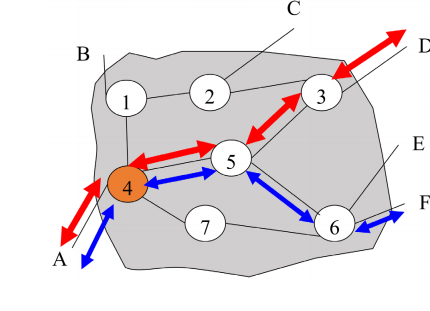

**数据包和虚电路**：
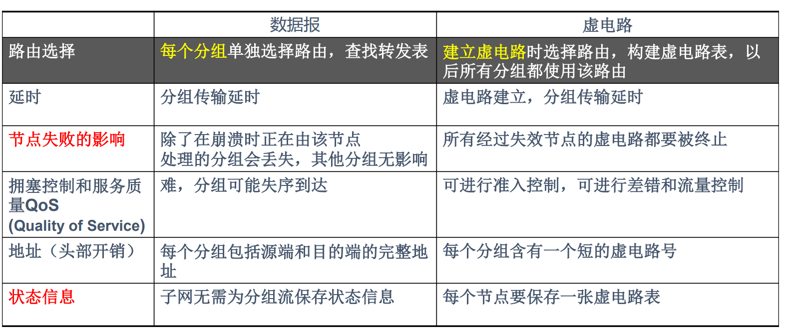

### 7.1.2 逐跳路由

​	根据**选择路由的方式**可以分为逐跳路由和源路由。

**逐跳路由：**每个节点仅知道路径上的下一跳节点，可能短暂出现**路由回路**。

**单播路由：**单个目的节点

**多播路由**：一个或多个源发送分组给**多个目的节点**，多个节点共同维护一颗组播树。

#### 路由方式

1. 严格源路由：发送方给出路径上**每个节点**列表，要求严格按照列表进行转发，途中**不允许经过其他节点**，即要求节点列表上的相邻节点也是路径上的相邻节点
2. 松散源路由：给出路径上**需要途径的节点**列表，**允许通过不在列表中的节点**

可结合在一起，通过位图(bit map)来说明哪一段为严格或松散源路由

## 7.2 Internet网络层

​	**网络层提供的服务：为高层提供节点到节点的传输，经过多跳传输最终到达目的地**

**Internet设计原则**：

1. 连接各种类型的异构网络

   **沙漏模型，IP时核心**，要求下层物理网络提供基本数据递交功能

   **无连接方式，IP提供尽力递交(best-effort)的数据传输服务**:无带宽保证，分组可能丢失、失序、延迟，无拥塞指示。

2. 路由器和链路故障仍能通信

   命运共享策略：只要网络连通，端系统间的通信仍然可继续

   - 无状态的路由设计：路由器不需要为端系统间的**分组流**维护状态信息
   - 软状态机制：路由表的维护通过**定期地刷新**(路由信息交换)来完成，**超时**状态被移走
   - 端到端地设计原则，

3. 有效利用网络资源，支持各种类型的应用

   端系统提供面向连接的可靠、按序递交的**TCP服务**和无连接方式的不可靠**UDP服务**

### 7.2.1 IP协议

​	RFC 791 定义了IP协议，IP协议分组格式的设计考虑到：

1. 无连接方式，提供转发支持：**源地址和目的地址**
2. 多个高层协议：**协议**(ICMP 0x01 、TCP 0x06、UDP 0x11)
3. 路由回路：**生命期TTL(Time to Live)**字段，每经过一个节点**转发时**，**TTL减1**，为0时丢弃，目的地收到TTL=0的分组不会丢弃
4. 分组出错：**头部检验和**字段，每跳都要重新计算
5. MTU限制：**分段和重组**

#### IP分组格式

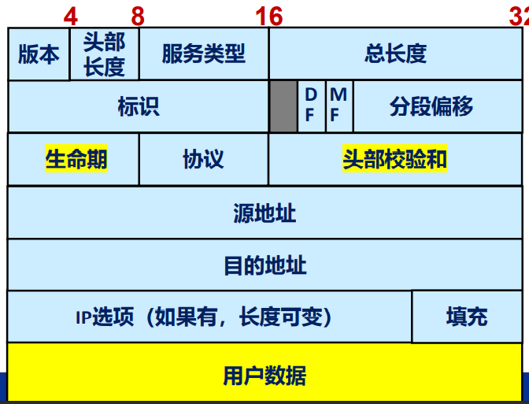

#### 分段和重组

​	IP采用**接收方重组**的策略，接收方要求能够处理长度至少为576字节的分段。通过IP源地址和目的地址+**分段标识(16bit)**标识原始分组，不是所有的分组都可以分段。

​	每个分段包含**分段偏移(13bit)**:分段携带的数据在原始IP分组中携带的数据部分所处未知的偏移量，单位为**8个字节**

​	**前面的分段携带数据必须为8的倍数！**

​	接收端通过如下标识判断分段均已到来：

- **MF**,标识后面是否还有分段，收到MF=0的分段，且之前所有的分段均已到来确认，可以重组。如果重组计时器超市，丢弃所有的分段
- **DF**:不允许分段，如果必须分段，则丢弃该分组，并发送**ICMP**差错报告给发送者

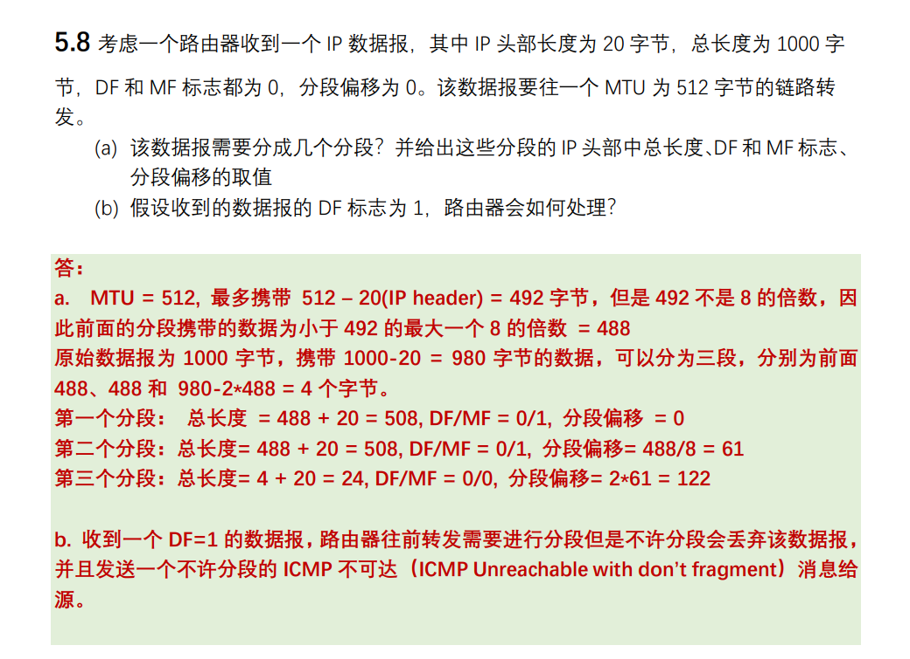

### 7.2.2 MAC地址

​	局域网中有多个节点，节点通过网卡连接到局域网，每个网卡有一个在**该局域网上唯一**的MAC地址。MAC地址用于标识某个网卡，并不需要描述是哪个局域网上的网卡，采用**平坦地址空间**

​	MAC地址为6个字节(48bit)，也称为EUI-48地址,前24个比特分配给某个厂商或机构。每个字节用16进制标识，之间用连字符或冒号隔开，例如：
$$
AC:DE:48:12:78:80\\
AC-DE-48-12-78-90
$$
​	**IEEE 802 标准在描述多字节整数采用最高字节在前的顺序，每个字节采用最低位在前(LSB)的顺序**，第一个字节的最低两位(LSB)有特殊含义：

1. 最低位为I/G：为0表示单播地址，为1表示组播地址
2. 次低位位U/L：位0时位全局地址，位1时是本地管理地址

例如：

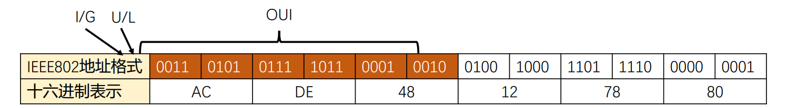

​	不是组播地址！

### 7.2.3 IP地址

​	每个节点都有一个IP地址：**ID+locator**

​	IPv4协议使用的IP地址位32比特的整数，采用**点十进制方法描述**,每个字节转换为十进制数字，中间以.隔开：

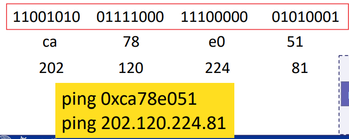

#### IP地址类

​	三类：A类、B类、C类，主机部分分别为3、2、1个字节

1. A类：1/2地址空间，网络号全0和127有特殊含义，则有126个网络，支持$2^{24}-2$台主机
2. B类：1/4地址空间，$2^{14}$个网络，$2^{16}-2=65534$个主机
3. C类：1/8地址空间，$2^{21}$个网络，254($2^8-2$)台主机

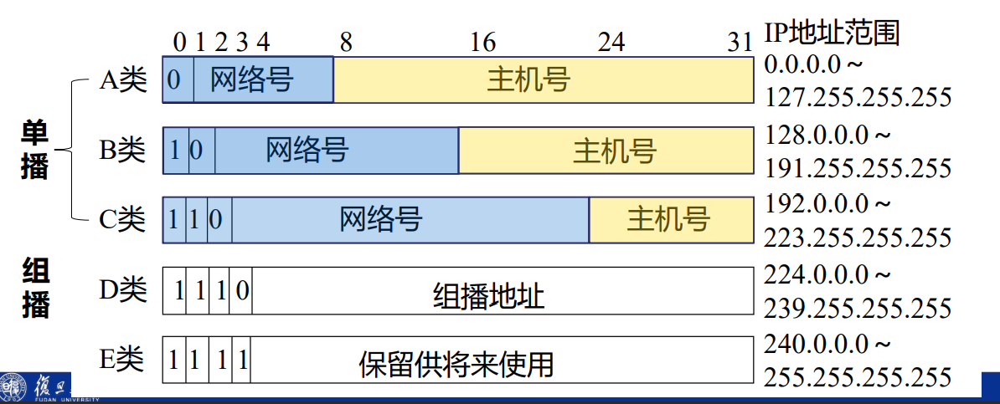

#### 特殊IP地址

​	全0表示this，全1表示all

- 主机部分，全0可表示本网络，比如202.120.224.9，全1可作为目的地址，表示网络中的所有主机，定向广播地址。
- 网络部分和主机部分，全1可作为目的地址，本地广播地址，表示接口上的所有IP主机。全0：
- 网络部分：全0：可作为源地址，表示尚未知道网络部分的地址，很少使用
- A类地址127.0.0.0，第一个字节为0111 1111 表示loopback地址

**回环地址**

​	**127.0.0.1**为回环地址(实际上为127.x.x.x)，对应名字loaclhost。任何发送到该地址的IP分组不会发送到实际的网卡上，而是由IP模块递交给高层相应的协议(TCP或者UDP)模块，可测试协议栈，可用于主机内不同进程间的通信，IP模块从高层收到目的地为**本机某个接口的IP地址**时通过回环接口递交给高层协议模块。

#### 子网地址

​	A类/B类/C类网络内部进一步划分子网，三层层次结构：网络ID+子网ID+主机ID

​	引入子网掩码，32bit的整数，使用点十进制方法描述，如果为主机部分，则对应的比特为0，否则为1，按**位与**来截取网络部分。一般之际部分位最后的一些比特，用/n表示前面n个比特(前缀)位网络部分：

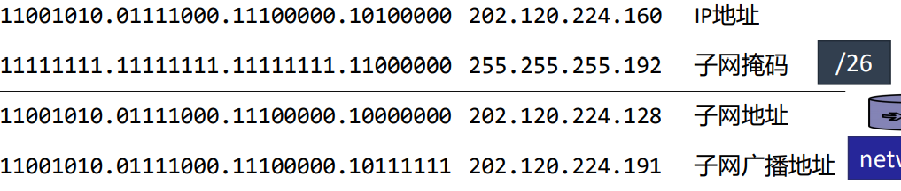

​	变长子网掩码VLSM，不同子网采用不同的子网掩码，例如202.120.224.0/24要分配给5个子网，其中3个子网要支持50台，另外2个子网支持30台主机：

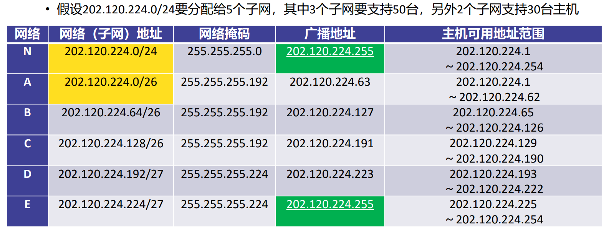

#### CIDR

​	抛弃IP地址类的边界，通过**地址汇集**的方法描述连续地址块(某个网络)。

​	用于描述网络部分的**网络掩码可以是任意长度**，从0到32

​	/32只有一个地址，表示主机

​	/31的掩码只有2个地址，常用于路由器之间的点到点链路上，**主机部分的0和1**不被解释位网络或广播地址

​	长度位0的掩码相当于任意IP地址，表示缺省路由

**子网和超网**

​	决定网络部分和主机部分的分界线从原来的IP地址类确定的界限往右移动，称为**子网**，往左边移动称为**超网**

**实例**

​	ISP拥有16个C类地址，192.60.128.0/20，假设某个用户需要1000个左右的IP地址，可以分配4个连续的C类地址，这4个C类地址被汇集称为：192.60.128.0/22

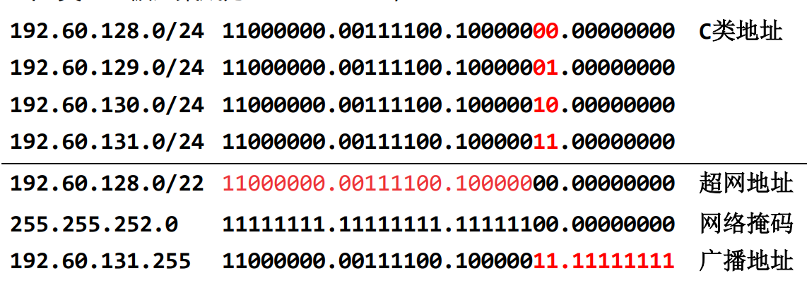

### 7.2.4 IP转发

​	接收分组，并查找转发表将分组转发给相应的外出接口。**转发表根据路由表来确定**

​	转发表一般包含:**目的网络/网络掩码**/下一跳/网络接口。

- 网络掩码为255.255.255.255(/32)的路由位**主机路由**
- 网络掩码为0.0.0.0(/0)的路由为**缺省路由**，当转发表中找不到路由时采用
- **直接路由**:目的节点和当前主机在同一网络，可直接通过对应的接口递交
- **间接路由**：需要通过下一跳路由器转发

​	转发过程不改变源和目的IP地址，改变的时MAC地址：

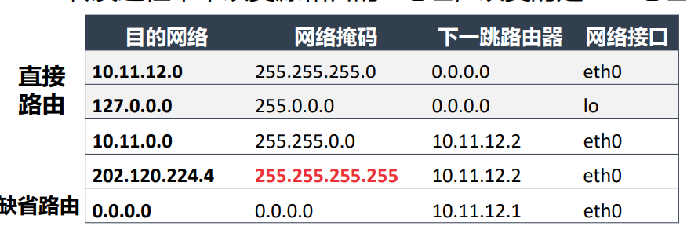

​	转发表中可能会有多个表项匹配，需要采取最长前缀匹配原则：网络掩码最长的匹配

### 7.2.5  地址解析协议ARP

​	该协议用于以太网等广播网络中，**将IP地址映射为MAC地址,RFC 826**

​	如果不知道IP地址对应的MAC地址，发送ARP请求，暂时保留IP分组在缓冲区。APR请求使用链路层广播发送：

​	Sender MAC address、Sender IP；`Target MAC address=?` (全0或全1，或者其他值)、Target IP

​	Target IP节点单播发送响应给发送者，源和目的字段对调，并填写源MAC地址：

​	`Sender MAC address`、Sender IP、Target MAC address、Target IP

​	IP地址和MAC地址映射保存在**ARP缓存**中，一定事件后移走。

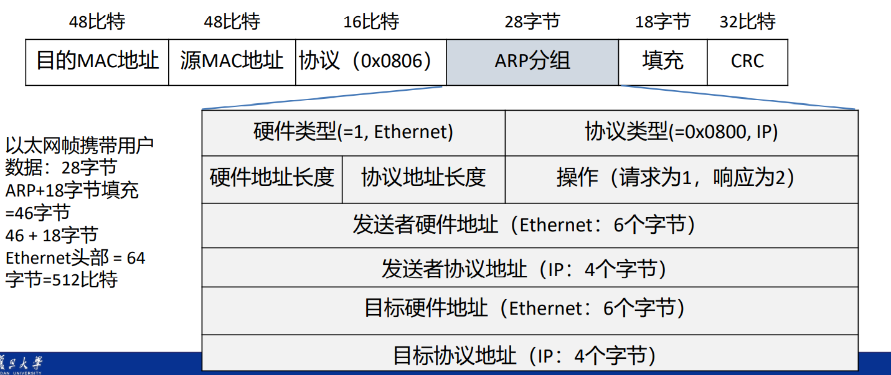

### 7.2.6 DHCP

​	动态主机配置协议DHCP（Dynamic Host Configuration Protocol）

- RARP(协议)：网卡地址$\rightarrow$IP地址，采用**以太网广播 **，无法跨越IP子网，仅能返回IP地址。
- BOOTP协议：为无盘工作站引导提供支持(IP地址+映像所在服务器+文件名)，采用**UDP协议**,允许跨越IP子网，除了**分配IP地址**外，还可传递**引导所必须的信息**:操作系统映像所在的主机和位置。

DHCP在**BOOTP基础上扩展**而来，采用C/S架构，采用UDP

- DHCP服务方端口号为67，客户方端口号为68
- DHCP服务器可提供**IP地址**,掩码，缺省路由器，DNS服务器，缺省TTL等参数配置
- 3种IP分配方法
  - 自动方法：根据唯一客户标识(比如网卡地址)**固定分配(租期无限，lease time =0xFFFF FFFF)**
  - **动态方法：从地址池种租用一个**
  - 手工方法：IP地址通过第三方方式分配，DHCP用于配置其他参数

### 7.2.7 NAT

​	内部网络中的主机一般不会要求在同一时刻全部连接到Internet，于是使用网络地址转换NAT，有多种形式。

#### 基本NAT

​	负责在内部网络用到的**内部IP地址**与外部用于连接到Internet的**公共IP地址**之间进行地址转换。

- 从内到外：转换**源地址**
- 从外到内：转换**目的地址**

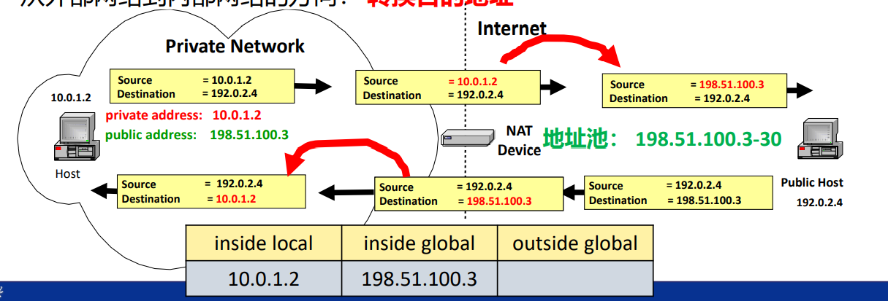

#### 基于端口的NAT(NAPT)

​	实现(IP地址+16bit的端口号)的转换。针对主机的每个会话进行映射，内部主机的应用(内网主机+端口)被映射为某个外部IP地址+端口号。

​	一个公共IP地址可以由65535个端口号，可对应内网中的6万多个socket(应用)

- 从内到外：转换**源地址+端口号**
- 从外到内：转换**目的地址+端口号**

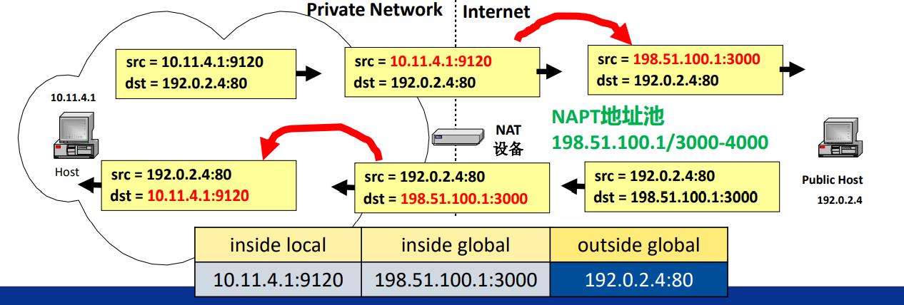	

NAT和NAPT仅根据IP分组头部和TCP段头部进行地址转换，某些应用层协议的消息中也包含了地址和端口号信息，需要配套的应用层网关进行相应的NAT转换：

#### 其他NAT形式

例如DNS协议中，含有DNS相应中的IP地址(A RR等)，采用**双向NAT**

​	双向NAT，内网中的主机可访问外网，通过DNS ALG也允许外网中的主机通过名字访问内网中的服务器，DNS响应给出的时服务器的内部地址，通过NAT时更新NAT映射表，对DNS响应中的IP地址进行地址转换。

**两次NAT (Twice NAT)**

​	内部网络(inside local)和外部网络(outside global)的IP地址空间有**重叠**时，这些具有重复IP地址的主机之间的分组的源地址和目的地址可能都需要进行转换

需要同时转换源IP地址+端口号以及目的IP地址和端口号

199.11.4.2:9120 --> 192.168.4.1:8080 通过NAT之后映射为 198.51.100.1:3000 --> 199.11.4.1:80

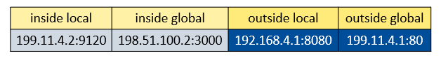

### 7.2.8 IP隧道

​	采用IP协议的网络上的任意两个节点之间建立的一条**虚拟链路**（虚拟接口 tun)

​	.....

### 7.2.9 IP组播

​	**组播:一对多或多对多**

**应用层组播**

​	不是由源直接单播给所有接收者，引入一个或多个中继节点，由源单播发送给中继节点，每个中继节点再单播发送给其他接收者。

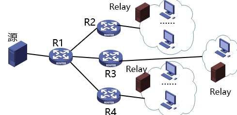

 **IP组播**	

​	由**网络层提供组播支持**，允许一个或多个发送者发送单一的IP分组到特定的多个接收者，组播路由器保证每个链路上最多只会由分组的一份拷贝。

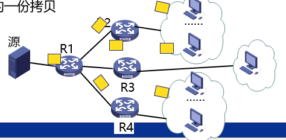

#### 任意源组播ASM

​	**发送者没有限制**，可以不属于组播组，组装一个组播帧(目的地址为组播地址)发送就可以了，接收者属于同一个组播组，通过**组播地址标识**。

​	组播组可任意规模，接收者可在Internet上**任何地方，动态加入或退出**

​	组播路由器负责将组播分组转发给所有成员所在的网络上，保证在任意一个网络上最多传输一次，者要求组播路由器知道其所连接的接口方向是否有成员存在，这样只需要往有成员存在的方向转发就可以了。

​	组播路由器间维护一个**组播分发树**，组播分组沿着该分组发送。

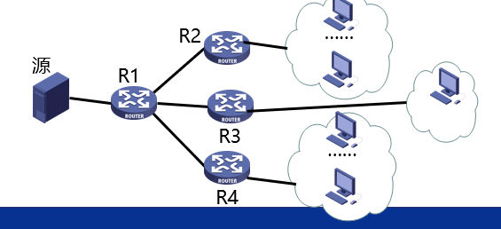

#### IP组播地址

​	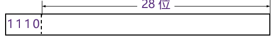

​	成员可位于Internet的任何地方，故组播地址采用**平坦地址**结构

`D类地址(组播地址)`：224.0.0.0~239.255.255.255

**永久组播地址**：路由和拓扑发现

- 由IANA分配，范围为224.0.0.0至224.0.0.255

- **本地唯一（Link-Local），TTL取值为1，不被转发到其他链路**

**临时组播地址**：

需要保证在一定的范围内没有其它的组播组使用同一地址： **如何为应用分配组播地址？**

**本地管理(内部）组播地址，地址范围为239.0.0.0～239.255.255.255**

- 类似于单播IP地址空间的内部地址，只在内部网络中使用
- 内部网络的出口路由器保证该组播分组不会被传播到Internet之上

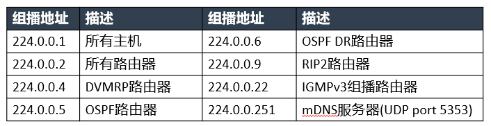

#### 单一源组播SSM

​	只有一个发送者，一个组播会话通过$<source,group>$标识，避免了原ASM模型中组播地址分配的问题，组播路由器将通过组播路由协议维护**基于源的组播分发树**，更加简单和高效。

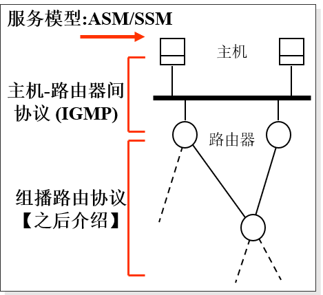

#### 组成员关系协议IGMPv2

​	IGMP协议工作在主机-路由器上，建立在IP上，协议号为2，组播路由器通过IGMP协议了解其所连接的那些链路上**是否有成员属于组播组**

​	每个组播路由器定期(**60到90秒，RFC标准为125秒**)，发送Query给**所有主机(224.0.0.1)**,主机收到Query后**发送Report到所属的组播地址G**。

​	反馈抑制：Query包含最大响应时间(**缺省10秒**)，主机选择$[0,Max\ Resp.Time]$时刻准备发送Report

​	主机在加入时主动发送Report(**间隔10s，发送2或3个Report**)

​	软状态机制：定期发送Query更新状态，超时时移走状态信息

**离开**

​	最后一次Query发送report的主机发送Leave Group消息给**所有(组播)路由器(224.0.0.2)**，随后组播路由器发送指定了组播组的Query，询问对于**特定的组播组G**是否还有成员在。

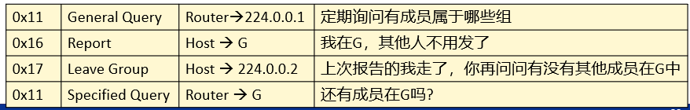

​	RFC 3376 给出了IGMPv3规范，支持**单一源组播SSM**

### 7.2.10 IPv6

​	IPv4匮乏，发明了IPv6

​	128bit

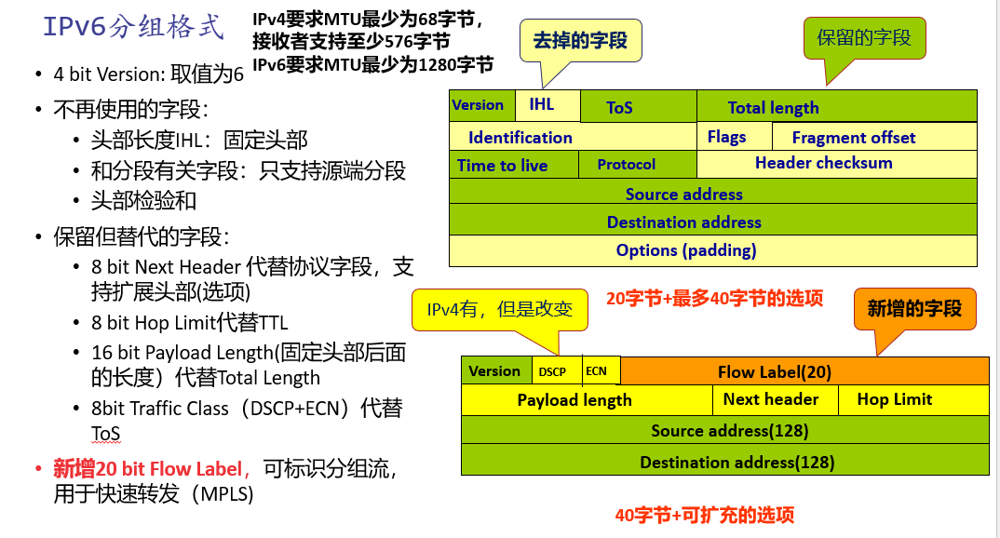

#### IPv6地址

​	以16bit为一组，分为8组，每组以十六进制书写，组与组之间用冒号分割。IPv6地址书写格式中的0可以压缩，每组中前面的0可以移走，连续的为全0的组可省略，但仅缩写一次(即两个冒号)：

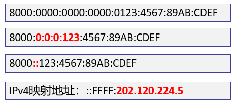

​	IPv4地址可在最低的32bit出现。

​	IPv6没有广播地址，组播地址为：FF00::/8 ,前面8bit全为1

​	IPv6接口会配置一个链路唯一的IPv6地址(FE80::/10)，与链路上的其他IPv6主机通信，IPv6接口还可配置一个全局单播地址：
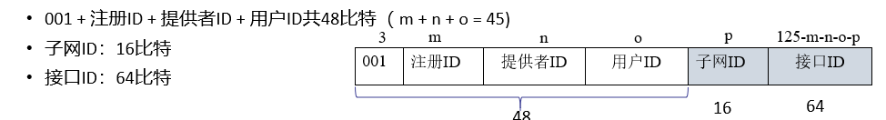

#### 配置IPv6地址

**链路唯一的IPv6地址**(FE80::/10)，即：

​	**1111 1110 10 +54个0** + `64bit的接口地址`，可与主机链路上的主机通信

**全局唯一的IPv6地址**

​	可采用**DHCPv6**获得IPv6地址以及其他配置信息

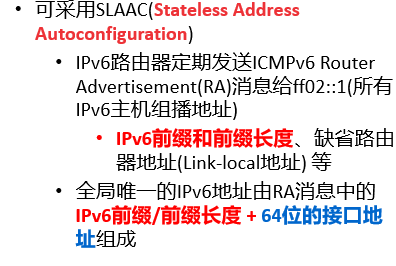

**64bit接口地址**

​	基于MAC地址得到，拆成前后两部分，中间加上FF：FE，并将第七位(U/L比特取反)即可，例如：
$$
00-d0-59 - 59-38-80\\
00d0:59ff:fe59:3880 \\(前八位为0000\ 0000 ),则\\
02d0:59ff:fe59:3880
$$
​	也可进行跟踪，有安全隐患。

# 8.路由协议

​	建议直接看PPT，比书上清晰一些

# 9.物理层

​	两个相邻节点通过**传输媒体**传递信息

​	**传输媒体(介质)**:相邻节点间实际传送信息的物理载体。传输媒体具有不同的带宽和抗干扰能力，限制了最大数据速率。**带宽**指的时其上面允许通过的信号的**频率范围的宽度**

## 9.1 传输媒体

​	**物理信道**常指从变换器输出到反变换器输入之间的部分，除了实际载体外，还包括**天线**、滤波器以及功率**放大器或者转发器**等附加通信设备，**广义的传输媒体**

**单工(simplex)通信：**系统只有一端可以发送，另一端只能接收。 

**双工(duplex)通信：**信道的两端都可以发送和接收 

- **全双工(full duplex)通信**：任何时刻在两个方向上可以同时进行通信 
- **半双工(half duplex) 通信**：在两个方向上都可以进行通信，但在任何给定时刻只能在一个方向 上进行通信

基于传输媒体上信号的传播方向性，可分为：

**导向(guided)媒体**：实际的物理线缆限制了信号传播的路径，包括双绞线、同轴电缆、光纤、 电力线等 

**非导向(unguided)媒体：**信号通过空气、水等无形的载体进行传播，包括无线电通信、微波通 信、红外通信、激光通信、卫星通信、水声通信

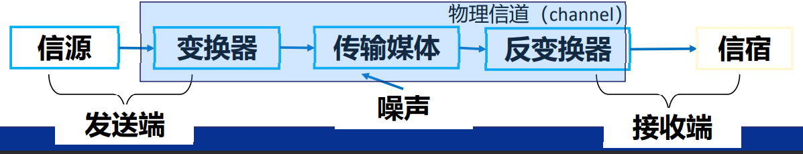

​	后面一堆传输媒体的介绍(例如双绞线，光纤，之类的，先跳过。

### 9.1.1 无线媒体

​	**衰减**指信号的强度随着其传输的距离增加而降低的现象

​	**自由空间传播模型**:距离越长，损耗越大，频率越高，损耗越大，即与**频率f(波长$\lambda$)和距离d**有关：
$$
\frac{发送功率}{接收功率}=(\frac{4\pi d}{\lambda})^2
$$
​	低、中频波段，波长长，可轻易越过障碍，**地波传播**

​	高频、甚高频(短波，超短波),沿地表传播会被吸收，但可通过电离层反射，达到更远的距离，**天波传播**，受天气和昼夜影响，不是很稳定。

​	超高频(微波)，地波传播衰减大，天波传播吹穿越电离层，一般采用**空间波(视线)传播**:

- 卫星微波：通过卫星中转
- 地面微波：采用较高的微波定向天线中转

#### 天线

​	无限媒体的发送和接收时通过天线实现的，分为全向天线和定向天线(**频率较高**)，天线的直径要求至少为无线信号的波长的**1/10**。

​	对于无线媒体而言，频率越高，支持的数据速率越高，传播的距离越小（衰减越大），绕过障碍物的能力越差，定向性更强

#### 通信

- **无线电通信**：使用3kHz到1GHz的频段，**受到无限电管制**,采用地波和天波传播，一般采用**全向传播**，适合**组播或者广播方式的应用**
- **微波通信**：1GHz~300GHz，也受到无线电管制，**ISM波段无需申请许可证，如2.4GHz和5GHz等**,地面微波采用**定向天线**支持视线传播
- **卫星通信**，利用**地球同步轨道**卫星为中继转发微波信号，无距离限制，但传播延时较长。
- 水声通信，采用**声波**在水中传播，声波传播速度大约只有1500m/s，延迟比较大

## 9.2 信道的最大数据速率

​	信道允许一定频率范围的信号通过(带宽)，数字信号的带宽时无限的，具有有限持续时间T的**数字信号**可看作以$T=\frac 1f$为周期的函数，由无限个正弦和余弦的多次**谐波（频率为nf）**组成。

​	信道带宽越小，通过谐波次数越少，信号越容易失真。

​	假设信道带宽为H Hz，调制时以S（=8）比特数据为一个信号单元（符号，Symbol），数据速率为 C bps，基波频率f = 1/T = C/S，则允许通过谐波次数为：
$$
n = \frac Hf = \frac{H\cdot S}{C}=\frac{8H}{C}
$$

### 9.2.1 Nyquist和Shannon定理

​	奈奎斯特采样定理给出了**有限带宽H**的无噪声信道的最大数据速率。

**采样定理**：只需以每秒2H次的频率采样就能够完整地重构原有地波形。

**波特率**(码元速率/调制速率)和数据速率：

- 波特率B：每秒信号状态变化的次数，以波特为单位，则B=2H
- 数据速率：每秒传输的比特数

$L$为信号可取的离散值的个数，实际信道中存在噪声，故离散值不能太多，则可得出最大速率为：
$$
C=2H\log_2L
$$
​	香农定理给出了受噪声干扰的信道最大数据速率。

**信噪比SNR：**用分贝dB为单位来表示：$10\lg\frac SN (dB)$

假设分贝值为$x (dB)$，则信噪比$=10^{\frac {x}{10}}$，则最大速率为：
$$
C=H\log_2(1+S/N)
$$
​	信道的最大速率受二者约束，取最小值。

## 9.3 数字编码

​	即从数字数据编码成数字信号，数字数据以数字信号方式在信道上传播。

**NRZ(Non-Return-Zero)编码**

​	一种信号状态(正电压)代表1，另一种信号状态(负电压)代表0，没有中间状态

**NRZI(NRZ Inverted on ones)** ：差分编码

​	比较相邻的信号单元，**用信号的跳变表示1**，无跳变表示0，解决了连续1的问题，但还是没解决连续0的问题

**曼彻斯特编码**

​	每个比特的传输都有电压的跳变，一个比特时间T分为两半:

- 高$\rightarrow$低为1
- 低$\rightarrow$高为0

​	编码效率只有50%

**差分曼彻斯特编码**

​	**比特时间的开始处**的跳变有无来表示0或者1，**有跳变表示0**，没有跳变表示1。每个比特时间仍然有一个跳变，用来同步。

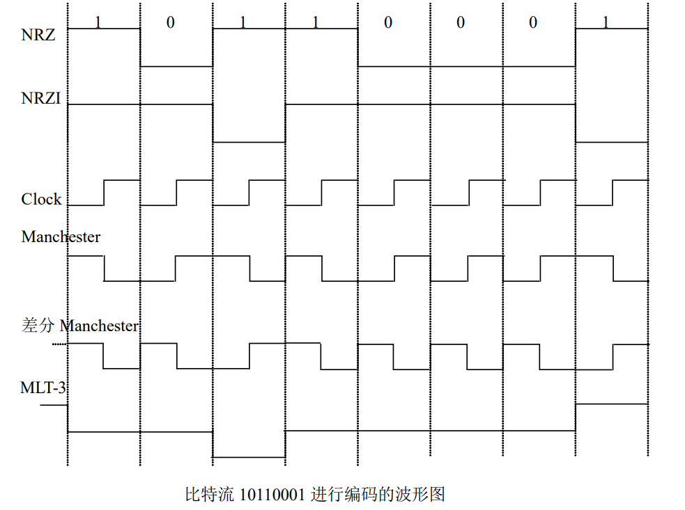

**4B5B编码**

​	4bit的数据用5bit的码组来编码：

- 保证码组前面没有多于1个“0”，尾部没有多于2个“0” 
-  采用4B5B编码的码组流不会出现超过连续3个“0”

5比特的码组再用NRZI编码（有跳变表示1） ，每个5比特的码组至少有2个“1”，也就是有2次跳变

​	效率是80%

## 9.4 数字调制

​	调相、调频和调幅：

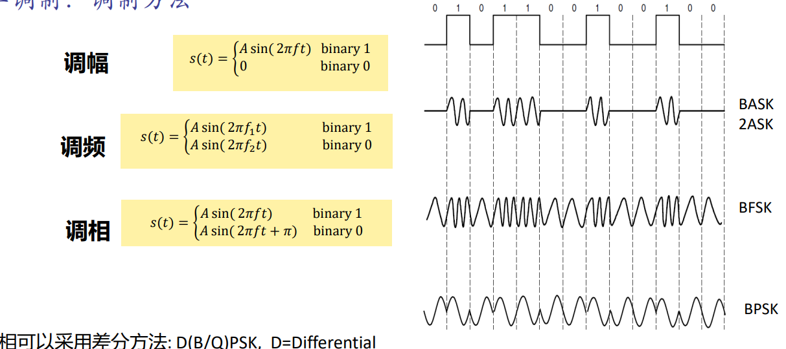

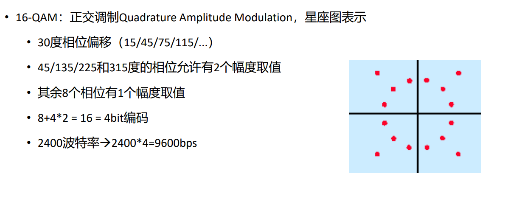